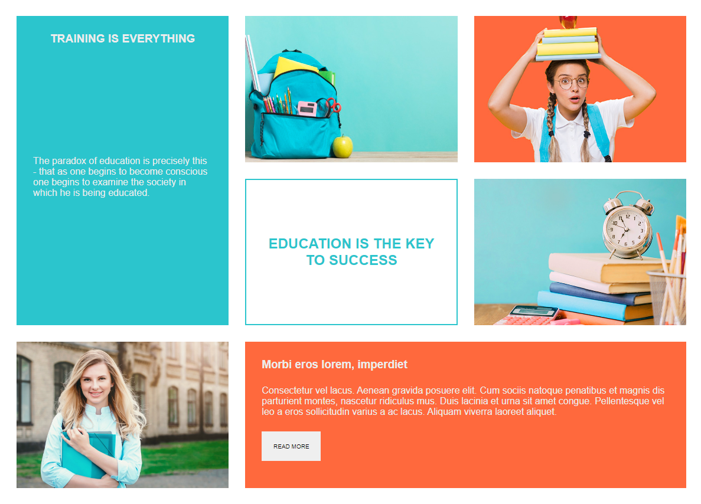

# Grid CSS - Cuarta entrega
 En este proyecto se ha abordado la construcción de un layout usando solo como maquetador CSS Grid y volviendola responsive.

 A continuación se adjunta una imágen final del maquetado y el despliegue del documento.

 [CSS Grid](https://entrega-grid.vercel.app/)
 

